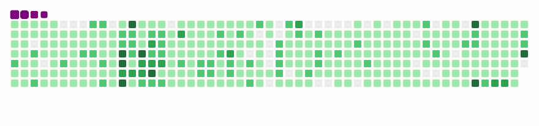

### Hello there 🖐️

### About me 

- 🖐️ I'm Samir Valiyev
- 📫 How to reach me: 
- [LinkedIn - @samirvaliyev](https://www.linkedin.com/in/samirvaliyev/)
- [Facebook - @samir.valiyev.1989](https://www.facebook.com/samir.valiyev.1989/)
- [Twitter - @samirvaliyev89](https://twitter.com/samirvaliyev89)

### Skills
### Backend
         

### Frontend
      
### Github Stats

- ***Github profile summary*** <a href="https://profile-summary-for-github.com/user/samirvaliyev">https://profile-summary-for-github.com/user/samirvaliyev</a>

